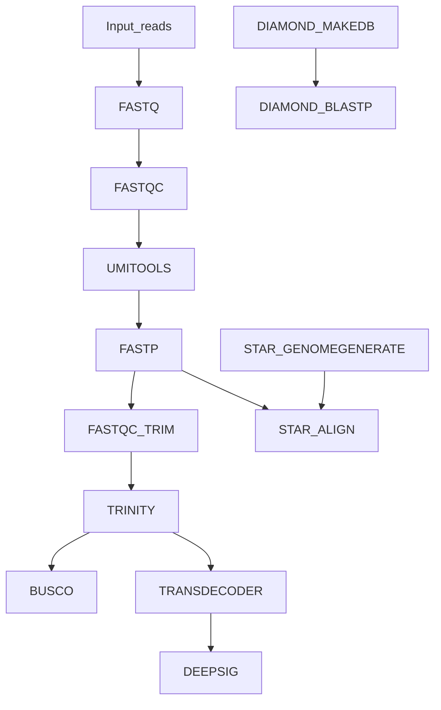

<h1>
  <picture>
    <source media="(prefers-color-scheme: dark)" srcset="docs/images/pipeline_logo.png">
    
  </picture>
</h1>

[](<[/actions/workflows/ci.yml](https://github.com/EPegueroS/transcriptassembler/actions/workflows/ci.yml)>)
[](https://github.com/EPegueroS/transcriptassembler/actions/workflows/linting.yml)

[](https://www.nextflow.io/)
[](https://www.docker.com/)

## Introduction

**transcriptassembler** is a bioinformatics pipeline that performs de novo transcriptome assembly and extensive transcript annotation.

The pipeline is still under development. The plan is to incorporate the latest machine learning tools to annotate and predict the structure/properties of the resulting RNAs after assembly and the predicted proteins/peptides.

## Pipeline diagram



## Usage

> [!NOTE]
> If you are new to Nextflow and nf-core, please refer to [this page](https://nf-co.re/docs/usage/installation) on how to set-up Nextflow. Make sure to [test your setup](https://nf-co.re/docs/usage/introduction#how-to-run-a-pipeline) with `-profile test` before running the workflow on actual data:

```bash
nextflow run transcriptassembler \
   -profile test,docker \
   --outdir <OUTDIR>
```

The previous command is equivalent to:

```bash
nextflow run transcriptassembler \
   -profile docker \
   --input ./assets/samplesheet_test.csv \
   --outdir <OUTDIR>
```

(The pipeline comes with a minimal test dataset defined in assets/samplesheet_test.csv)

Next, prepare a samplesheet with your input data that looks as follows:

`samplesheet.csv`:

```csv
sample,fastq_1,fastq_2
CONTROL_REP1,AEG588A1_S1_L002_R1_001.fastq.gz,AEG588A1_S1_L002_R2_001.fastq.gz
RUN2,READS1.fastq.gz,READS2.fastq.gz
```

Each row represents a fastq file (single-end) or a pair of fastq files (paired end).

Now, you can run the pipeline using:

```bash
nextflow run transcriptassembler \
   -profile docker \
   --input samplesheet.csv \
   --outdir <OUTDIR>
```

> [!WARNING]
> Please provide pipeline parameters via Nextflow `-params-file` option. Custom config files including those provided by the `-c` Nextflow option can be used to provide any configuration _**except for parameters**_; see [docs](https://nf-co.re/docs/usage/getting_started/configuration#custom-configuration-files).

For more details and further functionality, please refer to the [usage documentation](https://nf-co.re/transcriptassembler/usage) and the [parameter documentation](https://nf-co.re/transcriptassembler/parameters).

## Pipeline output

<!-- TODO nf-core: Document pipeline outputs. -->

## Credits

transcriptassembler was originally written by Esteban Peguero-Sanchez, Moises Sotelo Rodrigues and Teresa Romero-Gutierrez.

## Citations

<!-- TODO nf-core: Add citation for pipeline after first release. Uncomment lines below and update Zenodo doi and badge at the top of this file. -->

<!-- TODO nf-core: Add bibliography of tools and data used in the pipeline -->

An extensive list of references for the tools used by the pipeline can be found in the [`CITATIONS.md`](CITATIONS.md) file.

This pipeline is based on the nf-core framework standards:

> Philip Ewels, Alexander Peltzer, Sven Fillinger, Harshil Patel, Johannes Alneberg, Andreas Wilm, Maxime Ulysse Garcia, Paolo Di Tommaso & Sven Nahnsen.
>
> _Nat Biotechnol._ 2020 Feb 13. doi: [10.1038/s41587-020-0439-x](https://dx.doi.org/10.1038/s41587-020-0439-x).
